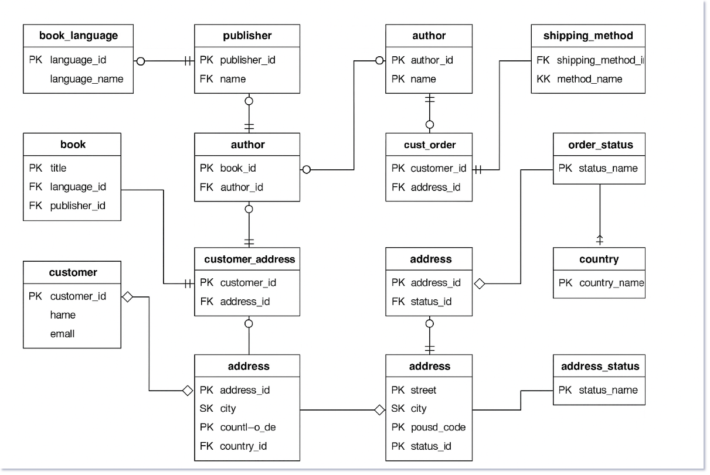

# bookstore_db
   

Entities & Attributes

1. book_language
   language_id (PK)
   language_name

2. publisher
   publisher_id (PK)
   name

3. book
   book_id (PK)
   title
   language_id (FK → book_language)
   publisher_id (FK → publisher)
   price

4. author
   author_id (PK)
   name

5. book_author (Associative Entity: M:N)
   book_id (FK → book) (PK)
   author_id (FK → author) (PK)

6. customer
   customer_id (PK)
   name
   email

7. address_status
   status_id (PK)
   status_name

8. country
   country_id (PK)
   country_name

9. address
   address_id (PK)
   street, city, postal_code
   country_id (FK → country)
   status_id (FK → address_status)

10. customer_address (M:N)
    customer_id (FK → customer) (PK)
    address_id (FK → address) (PK)

11. shipping_method
    shipping_method_id (PK)
    method_name

12. order_status
    status_id (PK)
    status_name

13. cust_order
    order_id (PK)
    customer_id (FK → customer)
    order_date
    status_id (FK → order_status)
    shipping_method_id (FK → shipping_method)

14. order_line
    order_line_id (PK)
    order_id (FK → cust_order)
    book_id (FK → book)
    quantity

15. order_history
    history_id (PK)
    order_id (FK → cust_order)
    status_id (FK → order_status)
     timestamp

      Key Relationships & Cardinalities
book ↔ book_language: Many books can have one language (M:1)

book ↔ publisher: Many books can be from one publisher (M:1)

book ↔ author: Many-to-Many via book_author

customer ↔ address: Many-to-Many via customer_address

address ↔ country: M:1

address ↔ address_status: M:1

customer ↔ cust_order: 1:M

cust_order ↔ shipping_method: M:1

cust_order ↔ order_status: M:1

cust_order ↔ order_line: 1:M

order_line ↔ book: M:1

cust_order ↔ order_history: 1:M

order_history ↔ order_status: M:1

   ER DIAGRAM FOR THE FOLLOWING DATABASE

   pls open using the following link

contributors
1. Ray Otieno
2. Bonface Matoke
3. Joseph Mshana
